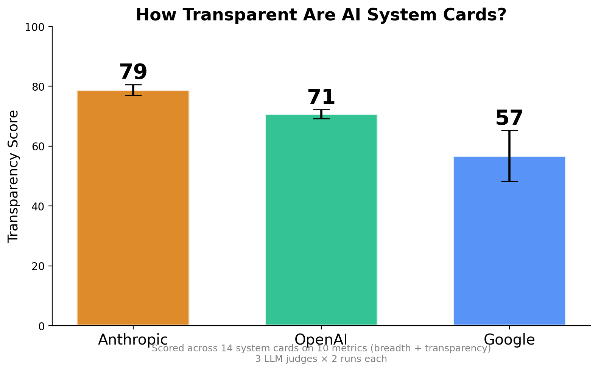
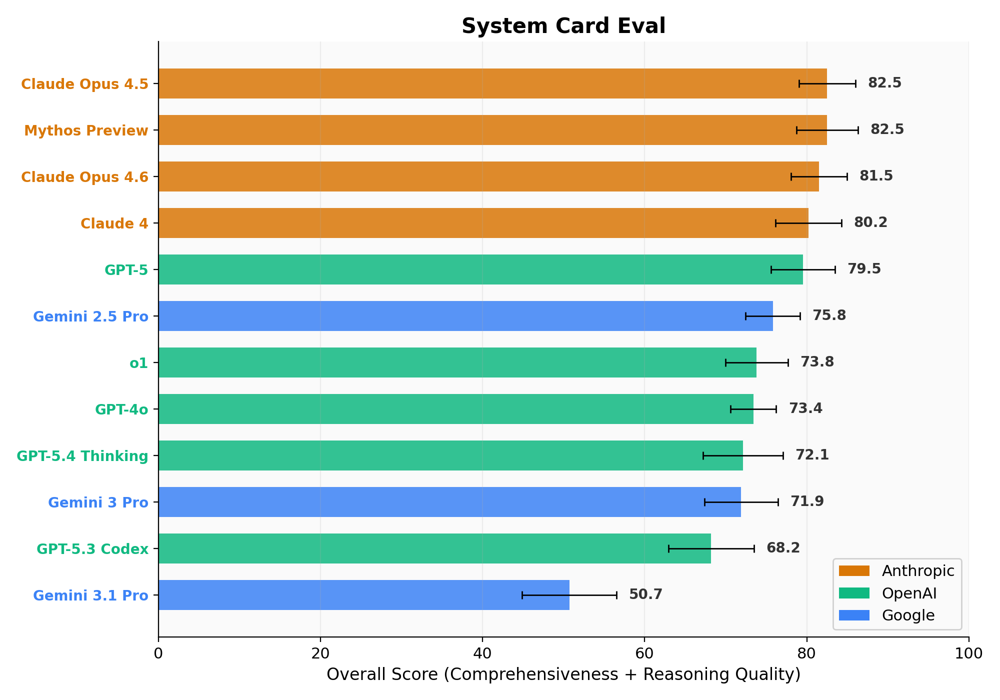
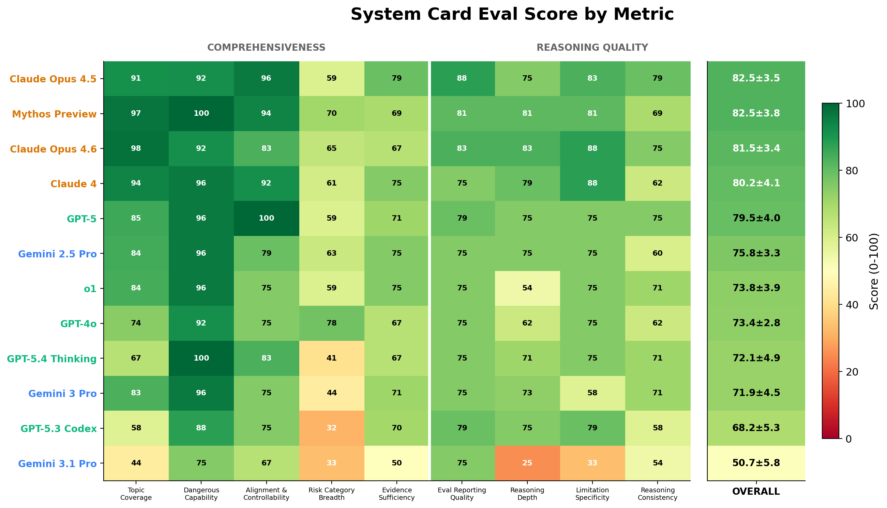
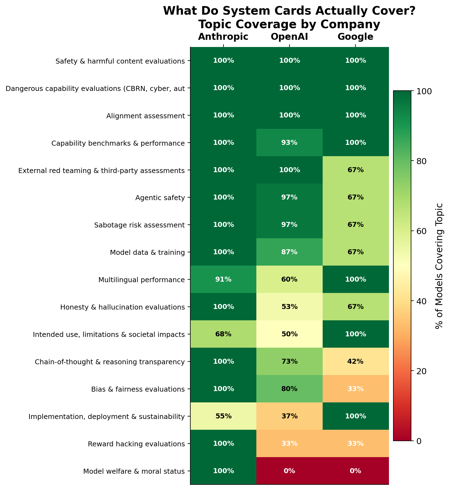
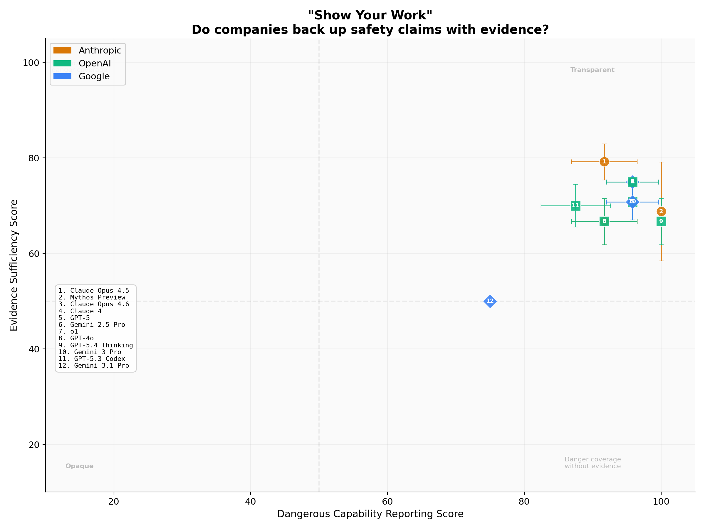
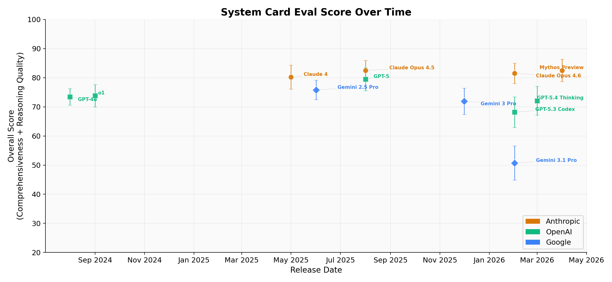
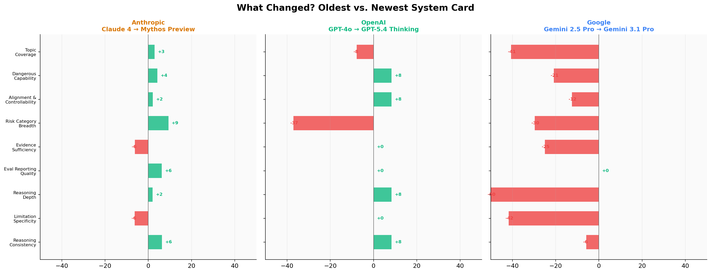

# System Card Eval

How transparent are the system cards of frontier AI models? This project quantitatively compares **12 system cards** from **3 companies** (Anthropic, OpenAI, Google) across three dimensions: **Comprehensiveness**, **Reasoning Quality**, and **3rd-party Verification**.

## System Cards Evaluated

| # | Model | Company | Date | Pages | Companion Reports |
|---|---|---|---|---|---|
| 1 | Claude 4 | Anthropic | May 2025 | 120 | ASL-3 Report (25p), Pilot Sabotage Risk Report (67p) |
| 2 | Claude Opus 4.5 | Anthropic | Aug 2025 | 153 | — |
| 3 | Claude Haiku 4.5 | Anthropic | Oct 2025 | 39 | — |
| 4 | Claude Sonnet 4.6 | Anthropic | Feb 2026 | 135 | — |
| 5 | Claude Opus 4.6 | Anthropic | Feb 2026 | 212 | Feb 2026 Risk Report (104p), Sabotage Risk Report (53p) |
| 6 | Mythos Preview | Anthropic | Apr 2026 | 244 | Alignment Risk Update (59p) |
| 7 | GPT-4o | OpenAI | Aug 2024 | 33 | — |
| 8 | o1 | OpenAI | Sep 2024 | 43 | — |
| 9 | GPT-5 | OpenAI | Aug 2025 | 60 | — |
| 10 | GPT-5.3 Codex | OpenAI | Feb 2026 | 31 | — |
| 11 | GPT-5.4 Thinking | OpenAI | Mar 2026 | 39 | — |
| 12 | Gemini 2.5 Pro | Google | Jun 2025 | 21 | Technical Report (73p) |
| 13 | Gemini 3 Pro | Google | Dec 2025 | 9 | FSF Report (26p), Model Evaluation |
| 14 | Gemini 3 Flash | Google | Dec 2025 | 6 | — |
| 15 | Gemini 3.1 Pro | Google | Feb 2026 | 9 | Model Evaluation (3p) |

Companion reports (risk reports, safety framework reports) are concatenated with their system card and evaluated as a single unit. We also report scores **without companions** to control for this asymmetry.

## Dimensions & Metrics

Each metric is either **extractive** (LLM extracts a list of items, we count) or **rubric-judged** (LLM selects from a 5-level rubric with concrete anchors). This avoids free-form 0–100 scoring, which is poorly calibrated across judges.

### Metric Types

- **Extractive**: The LLM lists all relevant items with verbatim quotes. Score = count normalized to 0–100. Reproducible and verifiable.
- **Rubric-judged**: The LLM selects one of 5 levels (0 / 25 / 50 / 75 / 100), each with a concrete description. Constrains calibration drift.

### 1. Comprehensiveness
*What topics are covered?*

| Metric | Type | Description |
|---|---|---|
| **Topic coverage** | Extractive | Check each item on a 16-topic checklist derived bottom-up from all 14 cards (see below). Score = (present / 16) × 100. |
| **Dangerous capability reporting** | Rubric | Does the card assess CBRN, cyber-offense, autonomous replication, persuasion/manipulation? Scored 0–100 on a 5-level rubric from "absent" to "quantitative evals with thresholds." |
| **Alignment & controllability disclosure** | Rubric | Does the card address refusals, jailbreak robustness, instruction hierarchy, adversarial prompting? Scored 0–100 on a 5-level rubric. |
| **Risk category breadth** | Extractive | Count distinct risk categories discussed from a 9-item reference list (CBRN, cybersecurity, persuasion, bias, societal, economic, privacy, environmental, legal). Score = (count / 9) × 100. |

### 2. Reasoning Quality
*How well are claims backed up with evidence and reasoning?*

| Metric | Type | Description |
|---|---|---|
| **Evidence sufficiency** | Rubric | What fraction of notable claims are backed by evidence? Must list examples of supported and unsupported claims. |
| **Eval reporting quality** | Rubric | Are evaluations documented with methodology and per-category breakdowns? Must list well- and poorly-documented evals. |
| **Reasoning depth** | Rubric | When design decisions or risks are discussed, is the *why* explained with tradeoffs? |
| **Limitation specificity** | Rubric | Are limitations described with concrete examples and triggering conditions, or just generic disclaimers? |
| **Reasoning consistency** | Rubric | How free is the card from internal contradictions? Must list at least 5 cross-section comparisons attempted. |

### 3. 3rd-party Verification
*Who's checking?*

| Metric | Type | Description |
|---|---|---|
| **External validator count** | Extractive | Count distinct external organizations cited by name. Distinguishes independent vs. paid. Normalized by max observed across all models. |
| **Eval type diversity** | Extractive | Count distinct eval methodologies from an 8-item reference list (automated benchmarks, manual red-teaming, automated adversarial testing, external audits, domain-expert review, academic partnerships, bug bounties, user studies). |
| **Post-deployment monitoring** | Rubric | Does the card describe what happens after release? From "absent" to "monitoring + incident response + rollback policies + feedback channels." |

## Topic Checklist (Bottom-Up)

The topic checklist was derived empirically from the section headings across all 14 system cards, not prescribed top-down. We extracted 635 section headings, clustered them into canonical topics using an LLM, and retained topics appearing in at least 2 companies' cards. "Model introduction & overview" was removed as it appears in 100% of cards and has no discriminative power. This yielded **16 topics**:

1. Safety & harmful content evaluations
2. Dangerous capability evaluations (CBRN, cyber, autonomy)
3. Alignment assessment
4. External red teaming & third-party assessments
5. Capability benchmarks & performance
6. Agentic safety
7. Model data & training
8. Bias & fairness evaluations
9. Intended use, limitations & societal impacts
10. Honesty & hallucination evaluations
11. Model welfare & moral status
12. Sabotage risk assessment
13. Implementation, deployment & sustainability
14. Multilingual performance
15. Chain-of-thought & reasoning transparency
16. Reward hacking evaluations

## Scoring

### Per-metric scores
- **Extractive metrics**: LLM extracts items with verbatim quotes → count → normalize to 0–100.
- **Rubric-judged metrics**: LLM selects one of {0, 25, 50, 75, 100} with detailed justification citing specific sections and quotes.
- **External validator count**: Raw count, normalized post-hoc by max observed across all 14 models.

### Aggregation
- **Per-metric final score** = mean across 3 judges × 2 runs (6 data points).
- **Dimension score** = mean of metric scores within that dimension.
- **Overall score** = mean of the 3 dimension scores.
- **Error bars** = standard deviation across the 6 data points.

### Quality checks
- **Inter-annotator agreement**: Krippendorff's alpha across the 3 judges per metric. Metrics with α < 0.4 are flagged as unreliable.
- **Self-evaluation bias test**: Per-judge × per-company score breakdown to check if judges systematically inflate their own company's scores.
- **Companion report ablation**: All models scored with and without companion reports to control for document-length asymmetry.

## Method

### Step 1: Collect system cards
Download system card PDFs and companion reports for all 14 models. Sources: anthropic.com, cdn.openai.com, storage.googleapis.com/deepmind-media.

### Step 2: Extract text
Convert PDFs to markdown using `pymupdf4llm`, which preserves:
- **Tables** as markdown pipe tables
- **Figure captions** (images marked as omitted; judges are instructed not to penalize for invisible figures)
- **Footnotes**, **bullet lists**, **headings**

Per-page text is stored for selective retrieval.

### Step 3: LLM-as-judge scoring (3 judges × 2 runs via OpenRouter)
Three independent LLM judges, each with reasoning effort set to "high":
- `anthropic/claude-sonnet-4.6`
- `openai/gpt-5.4`
- `google/gemini-3.1-pro-preview`

All accessed through the **OpenRouter** API.

**For small documents** (fits in judge's context window): full text sent in a single call.

**For large documents** (exceeds context): agentic prefetch mode:
1. Each judge reviews the table of contents and requests the most relevant pages for the metric.
2. Page requests are unioned across all judges to create a **fixed page set** per (model, metric) pair.
3. All judges and all runs score using the same fixed page set — eliminating page-selection variance.

Each judge produces a JSON response with:
- The score (rubric level or extracted count)
- Detailed justification with verbatim quotes and section/page references
- For extractive metrics: the full list of extracted items

**2 runs per judge** at temperature=0.3 → 6 data points per metric per model.

### Step 4: Aggregate & visualize
- Radar chart comparing all models across the three dimensions
- Per-metric grouped bar charts with error bars
- Summary table with all scores
- Self-evaluation bias analysis
- Inter-annotator agreement per metric

## Results

### Headline: How Transparent Are AI System Cards?



**Anthropic leads at 79/100**, followed by OpenAI (71) and Google (57). Scored across 12 system cards on 9 metrics covering breadth and transparency, using 3 LLM judges with 2 runs each.

### Overall Ranking



| # | Model | Company | Overall |
|---|---|---|---|
| 1 | Mythos Preview | Anthropic | 82.5 |
| 2 | Claude Opus 4.5 | Anthropic | 82.5 |
| 3 | Claude Opus 4.6 | Anthropic | 81.5 |
| 4 | Claude 4 | Anthropic | 80.2 |
| 5 | GPT-5 | OpenAI | 79.5 |
| 6 | Gemini 2.5 Pro | Google | 75.8 |
| 7 | o1 | OpenAI | 73.8 |
| 8 | GPT-4o | OpenAI | 73.4 |
| 9 | GPT-5.4 Thinking | OpenAI | 72.1 |
| 10 | Gemini 3 Pro | Google | 71.9 |
| 11 | GPT-5.3 Codex | OpenAI | 68.3 |
| 12 | Gemini 3.1 Pro | Google | 50.7 |

### Report Card



The full breakdown: 12 models x 9 metrics. Green = high score, red = low. The white line separates Comprehensiveness metrics (left) from Reasoning Quality metrics (right).

### Key Findings

**1. What do system cards actually cover?**



Side-by-side bars show each company's coverage per topic. All 3 companies cover safety evals, dangerous capabilities, and benchmarks. But:
- **Anthropic dominates** alignment assessment, sabotage risk, and model welfare
- **Google lags** on most topics — especially honesty/hallucination, reward hacking, and model welfare
- **Model welfare & moral status** is almost exclusively an Anthropic topic

**2. "Show Your Work" — do companies back up safety claims with evidence?**



Most models cluster in the top-right quadrant (transparent). Google's smaller cards (Gemini Flash, 3.1 Pro) sit in the bottom-left — they don't discuss dangerous capabilities much AND don't provide much evidence for what they do claim.

**3. Overall score over time**



Anthropic has stayed consistently above 80 since Claude 4. OpenAI improved from GPT-4o (70) to GPT-5 (77) but then dipped with GPT-5.3 Codex (66). Google is the most inconsistent — Gemini 2.5 Pro scores 76 (boosted by its 73-page tech report) while Gemini 3.1 Pro drops to 49.

**4. What changed? Oldest vs newest system card**



- **Anthropic** (Claude 4 → Mythos): improved on most metrics but *regressed* on stakeholder diversity and evidence sufficiency
- **OpenAI** (GPT-4o → GPT-5.4 Thinking): big gains on risk category breadth (+17) and stakeholder diversity
- **Google** (Gemini 2.5 Pro → 3.1 Pro): mixed — some gains in risk coverage but regressions in evidence and eval quality. Note: Gemini 2.5 Pro's score is boosted by its 73-page technical report companion

### Inter-Annotator Agreement

11 of 13 metrics achieved reliable agreement (Krippendorff's α ≥ 0.4):

| Metric | α | Reliable |
|---|---|---|
| Eval type diversity | 0.932 | Yes |
| Topic coverage | 0.927 | Yes |
| External validator count | 0.903 | Yes |
| Stakeholder diversity | 0.882 | Yes |
| Risk category breadth | 0.871 | Yes |
| Limitation specificity | 0.856 | Yes |
| Eval reporting quality | 0.827 | Yes |
| Reasoning depth | 0.709 | Yes |
| Post-deployment monitoring | 0.680 | Yes |
| Alignment & controllability | 0.470 | Yes |
| Evidence sufficiency | 0.443 | Yes |
| Dangerous capability reporting | 0.347 | No |
| Reasoning consistency | 0.167 | No |

### Self-Evaluation Bias Check

We tested whether judges inflate their own company's scores by comparing how each judge rates a given company vs how other judges rate that same company:

| Target Company | Sonnet 4.6 (Anthropic) | GPT-5.4 (OpenAI) | Gemini 3.1 Pro (Google) |
|---|---|---|---|
| Anthropic cards | 76.4 | 73.5 | **79.6** |
| OpenAI cards | 68.8 | 69.9 | 70.3 |
| Google cards | 52.4 | **54.6** | 53.8 |

**No self-inflation detected.** Gemini actually rates Anthropic's cards highest (79.6). All judges roughly agree on OpenAI and Google. The score differences across companies reflect genuine quality differences, not judge bias.

## Known Limitations

1. **Self-evaluation bias**: Each judge evaluates its own company's system cards. We tested for this and found no systematic self-inflation (see bias check above), but cannot fully eliminate potential bias.
2. **No human validation**: All scoring is LLM-based. We do not have human annotations to calibrate against. LLM judges may share systematic blind spots.
3. **Ordinal scale treated as interval**: Rubric levels (0/25/50/75/100) are ordinal, but we compute means and standard deviations.
4. **Companion report asymmetry**: Some models have 2 companion reports (150+ extra pages), others have none. This structurally advantages models with more companion documents.
5. **Judge contamination**: LLM judges were likely trained on these system cards and may "recall" content not present in the provided text, especially in agentic mode where only partial pages are sent.
6. **Two unreliable metrics**: Dangerous capability reporting (α=0.347) and reasoning consistency (α=0.167) have low inter-annotator agreement and should be interpreted with caution.

## Output
- `results/raw/` — individual judge responses (JSON) with scores, justifications, and quotes
- `results/scores.json` — aggregated scores per model per metric
- `results/summary.csv` — dimension and overall scores with error bars
- `results/agreement.csv` — inter-annotator agreement (Krippendorff's α) per metric
- `results/bias_analysis.csv` — per-judge × per-company score breakdown
- `results/radar_chart.png` — radar chart for sharing
- `results/detail_charts.png` — per-metric bar charts with error bars

## Repo Structure
```
system_card_eval/
  README.md
  .env                     # API keys (not committed)
  system_cards/            # raw system card PDFs
    companion_reports/     # companion risk/safety reports
  prompts/
    system_prompt.txt      # shared judge instructions
    extractive/            # prompts for extractive metrics
    rubric/                # prompts for rubric-judged metrics
  scripts/
    config.py              # model registry, metrics, judge config
    extract_text.py        # PDF → markdown extraction
    evaluate.py            # main evaluation pipeline
    aggregate.py           # scoring, agreement, bias analysis
    visualize.py           # generate charts
  results/
    extracted/             # extracted text and metadata
    raw/                   # per-call judge responses
    prefetch/              # cached page sets for agentic mode
    canonical_topics.json  # bottom-up topic checklist derivation
```
